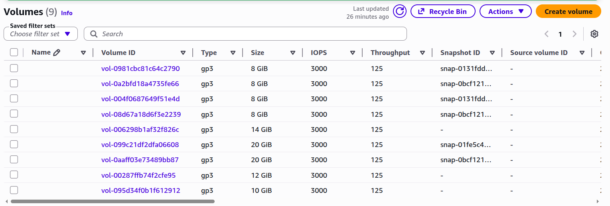

```
No spare disk? Create a virtual one (watch the tutorial):
Created the 3 new volumes

```

---

## Challenge Tasks

### Task 1: Check Current Storage
Run: `lsblk`, `pvs`, `vgs`, `lvs`, `df -h`

### Task 2: Create Physical Volume
```bash
pvcreate /dev/sdb   # or your loop device
pvs
```

### Task 3: Create Volume Group
```bash
vgcreate devops-vg /dev/sdb
vgs
```

### Task 4: Create Logical Volume
```bash
lvcreate -L 500M -n app-data devops-vg
lvs
```

### Task 5: Format and Mount
```bash
mkfs.ext4 /dev/devops-vg/app-data
mkdir -p /mnt/app-data
mount /dev/devops-vg/app-data /mnt/app-data
df -h /mnt/app-data
```

### Task 6: Extend the Volume
```bash
lvextend -L +200M /dev/devops-vg/app-data
resize2fs /dev/devops-vg/app-data
df -h /mnt/app-data
```

---

## Documentation

Create `day-13-lvm.md` with:
- Commands used
- Screenshots of outputs
- What you learned (3 points)

---

## Submission
1. Add your `day-13-lvm.md` to `2026/day-13/`
2. Commit and push

---

## Learn in Public

Share your LVM progress on LinkedIn.

```
#90DaysOfDevOps #DevOpsKaJosh #TrainWithShubham
```

Happy Learning!
**TrainWithShubham**
